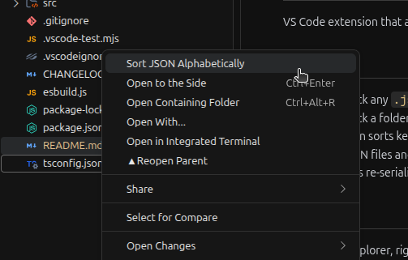

# Sort JSON Context Menu

Extensão do VS Code que adiciona o comando **"Sort JSON Alphabetically"** ao menu de contexto do Explorer, permitindo ordenar as chaves de arquivos JSON alfabeticamente com um único clique.

> ✨ **Um arquivo ou uma pasta inteira — você escolhe.** Ordene um único `.json` isoladamente ou selecione uma pasta para ordenar **em massa** todos os arquivos `.json` que ela contém, de uma só vez.

## Funcionalidades

- **Arquivo único** — clique com o botão direito em qualquer arquivo `.json` no Explorer e selecione **Sort JSON Alphabetically** para ordenar suas chaves recursivamente (no próprio arquivo).
- **Pasta inteira (bulk)** — clique com o botão direito em uma pasta para ordenar em lote todos os arquivos `.json` do nível superior de uma só vez, processando até 8 arquivos simultaneamente.
- A recursão ordena as chaves dentro de objetos aninhados e de objetos aninhados em arrays, sem reordenar os itens do array.
- Arquivos que não são JSON e JSONs inválidos são ignorados/reportados em vez de interromper o lote inteiro ao ordenar uma pasta.
- A saída é serializada novamente com indentação de 2 espaços e quebra de linha final.

## Uso

1. No Explorer, clique com o botão direito em um arquivo `.json` ou em uma pasta.
2. Selecione **Sort JSON Alphabetically**.
3. O(s) arquivo(s) são reescritos com as chaves ordenadas alfabeticamente.

## Requisitos

- VS Code `^1.125.0`.

## Limitações Conhecidas

- Apenas os arquivos do nível superior da pasta selecionada são ordenados; subpastas não são processadas recursivamente.

## Notas de Versão

Veja o [CHANGELOG.md](./CHANGELOG.md) para mais detalhes.
